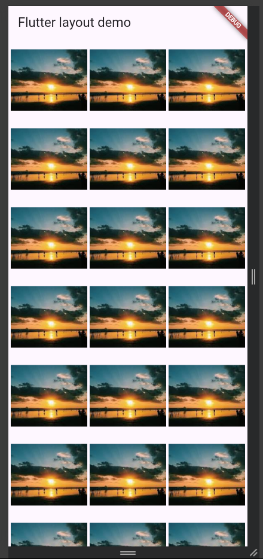
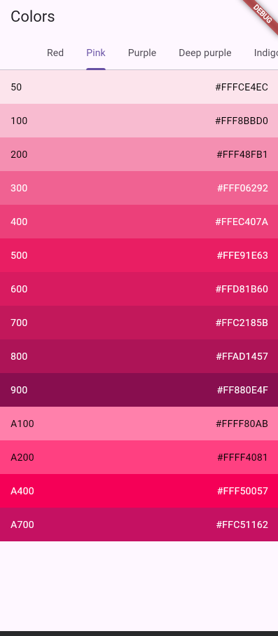

Langkah 1:Material apps

Langkah 2:Cupertino apps

Langkah 3:Non-Material apps

Langkah 4:Aligning widgets

Langkah 5:Packing widgets

Langkah 6:Nesting rows and columns

Langkah 7:Examples (GridView)

Langkah 8:

Langkah 9:ListView

Langkah 10:Examples(Card)

Langkah 11:Examples (ListTile)

